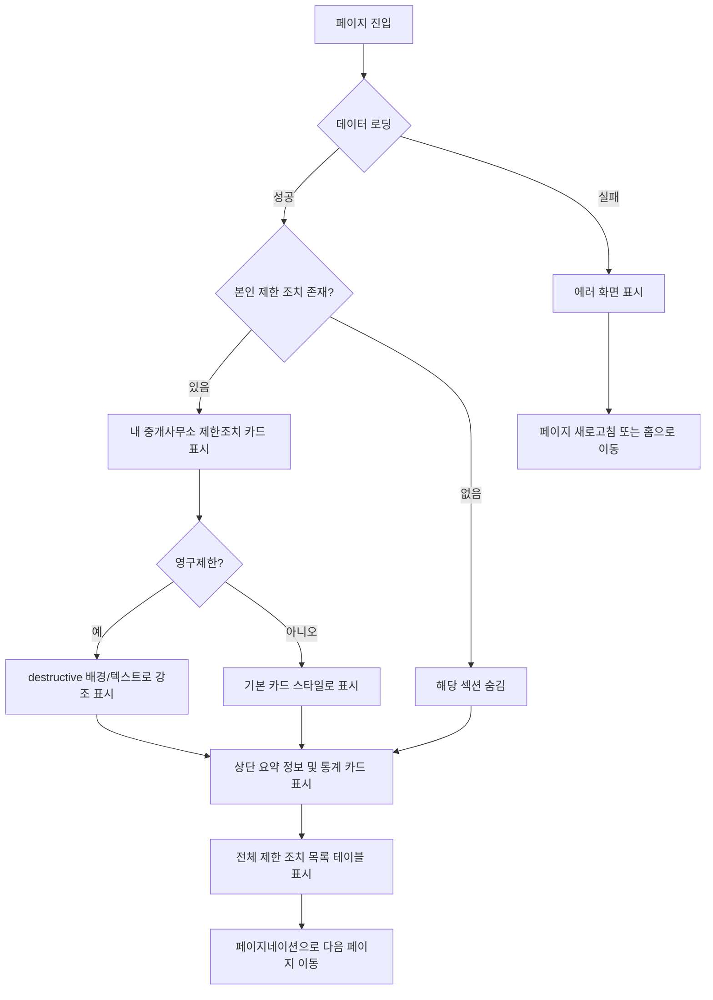
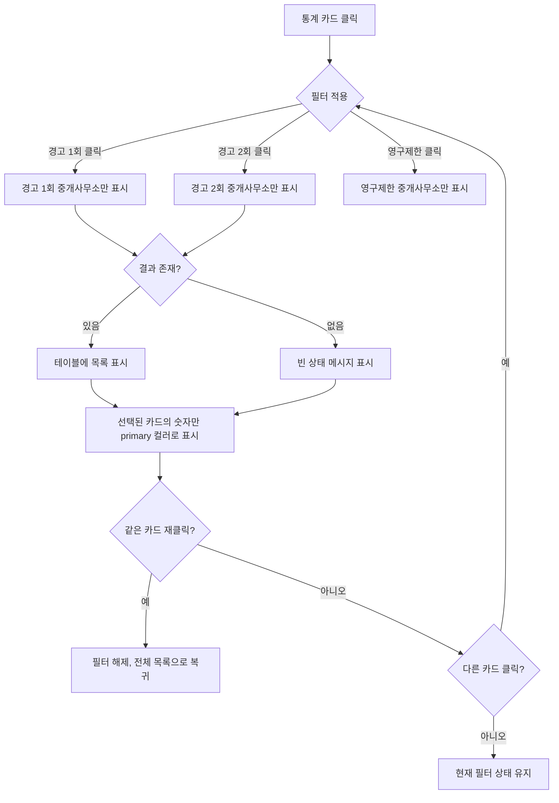

# 2026-01-23 claude로 rewright한 PRD

# 전체 중개사무소 제한조치 현황 (개선판)

## 개요

허위광고OUT 메뉴의 첫 번째 서브메뉴로, 전체 중개사무소의 제한조치 현황을 조회하고 관리할 수 있는 페이지입니다.

**프로젝트 배경**: 기존 레거시 페이지의 사용성을 개선하여 새로운 디자인으로 재구현하는 프로젝트입니다.

## 목표

- **본인의 제한 조치를 우선적으로 확인**할 수 있도록 제공
- 제한 조치된 중개사무소 현황을 한눈에 파악할 수 있도록 제공
- 제한 조치 유형별(활성 제한, 영구 제한) 현황을 빠르게 확인할 수 있도록 지원
- 제한 조치 내역을 시간순으로 확인하여 추이를 파악할 수 있도록 제공
- 개인정보를 보호하면서도 본인 정보는 명확히 확인할 수 있도록 지원

## 사용자 스토리

### 주요 사용자
- CEO 사이트를 사용하는 중개사무소 대표 (회원)
- **접근 권한**: 모든 CEO 사이트 회원

### 사용자 시나리오

1. **본인 조치사항 우선 확인**: 페이지 진입 시 내 중개사무소가 받은 제한 조치를 가장 먼저 확인하고 싶다
2. **영구제한 경고**: 영구제한 조치를 받은 경우 시각적으로 명확하게 인지하고 싶다
3. **현황 조회**: 제한 조치된 중개사무소의 전체 현황과 총 개수를 확인하고 싶다
4. **유형별 조회**: 경고 1회, 경고 2회, 영구 제한 조치를 받은 중개사무소를 각각 확인하고 싶다
5. **필터링**: 특정 제한 조치 유형을 클릭하여 해당 유형의 중개사무소만 목록으로 보고 싶다
6. **타 중개사무소 정보**: 다른 중개사무소의 정보는 개인정보 보호를 위해 마스킹 처리되어 확인하고 싶다

## 비즈니스 규칙

### 제한 조치 유형
제한 조치는 총 2가지 유형이 있습니다:

- **활성 제한 (Active Restriction)**
  - 일시적인 제한 조치
  - 경고 1회, 경고 2회를 포함
  - 기간이 명확함 (시작일 ~ 종료일)
  - 디자인 시스템 컬러: Grey (Foreground)
  
- **영구 제한 (Permanent Restriction)**
  - 영구적인 제한 조치
  - 경고 3회 이상인 경우 영구 제한 조치를 받게 됨
  - 종료일 없음
  - 디자인 시스템 컬러: Red (Destructive)

### 제한 조치 처리 규칙

- 중개사무소가 위반 정책을 위반하면 경고 1회가 부여됨
- 경고 1회를 받은 중개사무소가 다시 위반하면 경고 2회가 부여됨
- 경고 2회를 받은 중개사무소가 다시 위반하면 영구 제한 조치가 부여됨
- **제한 조치는 적층되므로** 가장 최근(심각한) 조치 상태만 유효함

### 데이터 업데이트 규칙
- 제한 조치 데이터는 **매일 자정에 배치 처리**로 업데이트됩니다

### 개인정보 보호 규칙
- **타인의 정보**: 중개사무소명과 대표자명의 첫 글자만 남기고 나머지는 `*`로 마스킹 처리
  - 예: "직방부동산(대표:홍길동)" → "직***(대표:홍**)"
- **본인의 정보**: 로그인한 사용자의 중개사무소 정보인 경우 전체 텍스트 노출
  - "내 중개사무소 제한조치" 섹션: 마스킹 없이 전체 텍스트
  - 전체 테이블 내 본인 정보: 마스킹 없이 전체 텍스트

## 페이지 구조

페이지는 다음 순서로 구성됩니다:

1. **내 중개사무소 제한조치** (조건부 표시)
2. **상단 요약 정보**
3. **제한 조치 유형별 통계 카드 및 필터**
4. **전체 제한조치 목록 테이블**

## 기능 요구사항

### 1. 내 중개사무소 제한조치 (신규)

**표시 조건**:
- [ ] 로그인한 사용자의 중개사무소가 제한 조치를 받은 경우에만 표시
- [ ] 제한 조치가 없는 경우 이 섹션 전체를 숨김

**표시 규칙**:
- [ ] 가장 최근(심각한) 제한 조치 **1건만** 표시
  - 제한 조치는 적층되므로 최신 상태만 유효
  - 우선순위: 영구제한 > 경고 2회 > 경고 1회

**레이아웃**:
- [ ] 섹션 제목: "내 중개사무소 제한조치"
- [ ] **카드 형태**로 표시
- [ ] 페이지 **최상단**에 위치 (통계 카드보다 위)

**카드 내 표시 정보**:
- [ ] **날짜**: 제한 조치 날짜 (yyyy-mm-dd)
- [ ] **처리**: 제한 조치 유형 (경고 1회, 경고 2회, 영구제한)
- [ ] **위반 정책**: 위반한 정책명

**카드 스타일**:

**일반 경고 (경고 1회, 경고 2회)**:
- [ ] 기본 카드 스타일
- [ ] 배경색 없음
- [ ] 텍스트 기본 색상

**영구제한**:
- [ ] 카드 전체 배경색: destructive 컬러 (10-20% opacity, 연하게)
- [ ] 텍스트 색상: destructive 컬러
- [ ] 시각적으로 명확하게 구분하여 경각심 제공

**반응형**:
- [ ] 데스크톱: 카드 형태로 표시
- [ ] 모바일: 카드 형태 유지, 폭 100%

### 2. 상단 요약 정보
- [ ] 제한 조치된 중개사무소 총 개수 표시
- [ ] 리스팅한 기간 표시 (최근 1년 기준, yyyy-mm-dd 형식으로 표기)
  - 예: "최근 1년 기준 (2025-01-16 ~ 2026-01-16)"

### 3. 제한 조치 유형별 통계 카드 및 필터 (대시보드)
**레이아웃**: 가로 나열 카드 형태

**카드 구성**:
- [ ] 4개의 카드가 가로로 나열됨: [전체], [경고 1회], [경고 2회], [영구제한]
- [ ] 각 카드는 작은 크기의 카드 형태
- [ ] 각 카드에는 "제한 조치 유형명: n건" 형태로 표시
  - 예: "경고 1회: 15건", "경고 2회: 8건", "영구제한: 3건"
- [ ] **전체 카드**는 합산 값으로 표시
  - 표기 형식: "전체: n건" (경고 1회 + 경고 2회 + 영구제한의 합)
  - 예: "전체: 26건"

**카드 상태**:
- [ ] **기본 상태 (필터 미선택)**:
  - 모든 카드가 동일한 기본 스타일
  - 텍스트 색상: 기본 텍스트 컬러
  - 배경색/테두리: 없음

- [ ] **활성화 상태 (필터 선택 시)**:
  - 선택된 카드의 **숫자(n건)만** primary 컬러로 변경
  - 레이블("경고 1회", "경고 2회" 등)은 기본 색상 유지
  - 배경색/테두리: 적용하지 않음
  - 예: "경고 1회: 15건"

- [ ] **비활성화 상태 (다른 필터 선택 시)**:
  - 선택되지 않은 카드들은 기본 텍스트 색상 유지

**필터 동작**:
- [ ] 카드 클릭 시 해당 조건의 중개사무소만 필터링되어 목록에 표시
- [ ] **단일 선택만 가능** (한 번에 하나의 필터만 적용)
- [ ] 기본 상태는 제한 조치된 중개사무소 전체 목록이 표시됨 (전체 카드 활성)
- [ ] 같은 카드를 다시 클릭하면 필터가 해제되고 전체 목록으로 복귀
- [ ] 필터 적용 시 해당 조건에 맞는 중개사무소가 없는 경우, 빈 상태 메시지를 표시
  - 빈 상태 메시지: "해당 조건에 맞는 제한 조치 내역이 없습니다."
  - 테이블 대신 빈 상태 메시지가 표시되고, 페이지네이션은 숨김 처리

**대시보드 역할**:
- 각 제한 조치 유형별 개수를 한눈에 파악할 수 있는 대시보드 기능 수행
- 클릭 한 번으로 필터링과 현황 파악을 동시에 제공

### 4. 전체 제한조치 목록 조회
- [ ] 제한 조치된 중개사무소 목록을 테이블 형태로 표시
- [ ] 한 페이지에 10개까지 노출
- [ ] 페이지네이션 적용
- [ ] 정렬 순서는 최신순 (제한 조치 날짜 기준 내림차순)
- [ ] 테이블 상단에 "총 n건" 표시

### 5. 테이블 컬럼 구성
테이블은 다음 5개의 컬럼으로 구성됩니다:

1. **날짜**
   - 제한 조치가 적용된 날짜
   - 표기 형식: yyyy-mm-dd (예: 2026-01-16)
   - 폰트: `font-size: var(--font-size-sm)`, `color: var(--foreground)`

2. **중개사무소**
   - 중개사무소 이름과 대표자명을 함께 표시
   - 표기 형식: "중개사무소이름(대표:대표자명)"
   - **개인정보 마스킹 처리**:
     - 타인의 정보: 첫 글자만 남기고 나머지는 `*`로 마스킹
       - 예: "직방부동산(대표:홍길동)" → "직***(대표:홍**)"
     - 본인의 정보: 전체 텍스트 노출
       - 예: "직방부동산(대표:홍길동)" (마스킹 없음)

3. **지역**
   - 중개사무소 소재지
   - 표기 형식: "시 구" 또는 "도 시 구" (공백으로 구분)
   - 예: "서울 강남구", "경기 성남시 분당구"
   - 폰트: `font-size: var(--font-size-sm)`, `color: var(--muted-foreground)`

4. **위반 정책**
   - 위반한 정책명 표시
   - "안심중개사규정" 또는 "안심광고관리규정" 또는 둘 다
   - 둘 다 위반한 경우: "안심중개사규정, 안심광고관리규정" 형식으로 표시
   - 폰트: `font-size: var(--font-size-sm)`, `color: var(--foreground)`

5. **처리**
   - 제한 조치 유형 표시
   - 값: "경고 1회", "경고 2회", "영구제한"

   - **영구제한인 경우**: 텍스트만 destructive 컬러로 표시 (배경색/테두리 없음)

### 6. 반응형 처리
- [ ] 모바일 해상도 390px 이하에서는 일부 컬럼을 미노출
- [ ] 390px 이하에서 표시되는 컬럼: 날짜, 중개사무소, 처리 (3개만)
- [ ] 390px 이하에서 미노출되는 컬럼: 지역, 위반 정책
- [ ] 390px 이하에서 테이블 가로 스크롤 없이 자연스럽게 컬럼 너비 조정

## UI/UX 요구사항

### 레이아웃
- 데스크톱: 사이드바 + 메인 컨텐츠 영역
- 모바일: 전체 화면 (사이드바는 햄버거 메뉴로 접근)

### 컴포넌트
- **내 중개사무소 카드**: 본인의 제한 조치 표시용 카드 (신규)
- **통계 카드**: 제한 조치 유형별 통계 숫자 표시 및 필터 버튼 역할 (작은 카드 형태)
- **Table**: 제한 조치 목록 표시 (zigbang-design-system.json의 Table 컴포넌트 사용)
- **Pagination**: 페이지네이션 컴포넌트
- **Typography**: 총 개수, 기간, 총 n건 등 텍스트 표시
- **Empty State**: 필터 결과가 없을 때 표시할 빈 상태 메시지
- **Error State**: API 오류 시 표시할 에러 화면

### 디자인 토큰
- 색상: zigbang-design-system.json의 colors 토큰만 사용
  - 영구제한 색상: destructive 컬러 사용
  - 영구제한 배경색: destructive 컬러 10-20% opacity
  - 활성화된 필터 카드 숫자: primary 컬러 사용
- 타이포그래피: Pretendard, 정의된 fontSizes/fontWeights만 사용
- 간격: spacing 토큰 사용
- 라운드: radius 토큰 사용

### 날짜 표기 규칙
- 날짜 형식: yyyy-mm-dd (ISO 8601 형식, 한글 기준)
- 예: 2026-01-16
- 리스팅 기간 표시: "2025-01-16 ~ 2026-01-16" 형식

### 반응형
- 모바일 기준점: 768px
- 특수 반응형: 390px 이하에서 컬럼 일부 미노출
  - 390px 이하: 날짜, 중개사무소, 처리 컬럼만 표시
  - 390px 초과: 모든 컬럼 표시

## 데이터 요구사항

### API 연동
- **API 명세 문서**: 별도 파일로 정의 예정 (링크 추후 업데이트)
- **데이터베이스**: 직접 접근 권한 없음, API를 통한 데이터 조회만 가능
- **데이터 업데이트**: 매일 자정 배치 처리

### 저장해야 할 정보
각 제한 조치 내역에는 다음 정보가 포함되어야 합니다:

- 제한 조치 날짜 (제한 조치가 적용된 날짜)
- 중개사무소 이름
- 중개사무소 대표자명
- 중개사무소 소재지 (시/도, 시, 구 정보)
- 중개사무소 ID (본인 정보 판별용)
- 로그인 사용자의 중개사무소 ID (마스킹 처리 판별용)
- 위반 정책 (안심중개사규정, 안심광고관리규정 중 하나 또는 둘 다)
- 제한 조치 유형 (경고 1회, 경고 2회, 영구제한)
- 제한 조치 분류 (활성 제한 또는 영구 제한)

### 통계 정보
페이지 상단에 표시할 통계 정보:
- 제한 조치된 중개사무소 총 개수
- 활성 제한 조치를 받은 중개사무소 개수 (경고 1회 + 경고 2회)
- 영구 제한 조치를 받은 중개사무소 개수
- 리스팅 기간 (최근 1년 기준 시작일과 종료일)

### 본인 조치사항 정보
- 로그인한 사용자의 제한 조치 존재 여부
- 가장 최근(심각한) 제한 조치 1건
  - 날짜, 처리 유형, 위반 정책

### 정렬 및 페이지네이션
- 목록은 제한 조치 날짜 기준 최신순으로 정렬되어야 함
- 한 페이지에 10개씩 표시
- 전체 개수 정보 제공 필요

## 사용자 플로우

### 기본 조회 플로우

### 필터링 플로우

## 우선순위

### Phase 1 (MVP)

1. **내 중개사무소 제한조치 섹션** (신규 - 최우선)
   - 조건부 표시 로직
   - 카드 형태 UI
   - 영구제한 시각적 강조 (destructive 배경/텍스트)
2. 상단 통계 정보 표시 (총 개수, 기간)
3. 제한 조치 유형별 통계 카드 및 단일 필터 기능
4. 개인정보 마스킹 처리 (본인 정보는 전체 노출)
5. 목록 조회 (최신순 정렬, 페이지네이션)
6. 테이블 컬럼 표시 (날짜, 중개사무소, 지역, 위반 정책, 처리)
7. 영구제한 텍스트 색상 처리 (destructive 컬러)
8. 반응형 처리 (390px 이하 컬럼 미노출)
9. 에러 화면 처리

### Phase 2 (향후 고려)
1. 검색 기능 (중개사무소명, 지역 검색)
2. 상세 정보 조회 모달
3. 엑셀 다운로드
4. 추가 필터링 옵션 (복수 선택, 날짜 범위 등)
5. 본인 조치사항 히스토리 전체 보기

## Success Criteria

이 기능 출시 후 달성하고자 하는 목표:

- **사용자가 페이지 진입 즉시 본인의 제한 조치 상태를 확인**할 수 있다
- **영구제한을 받은 사용자가 시각적 강조를 통해 심각성을 인지**할 수 있다
- 운영 관리자 및 회원이 제한 조치 현황을 5분 이내에 파악할 수 있다
- 제한 조치 유형별 현황을 클릭 한 번으로 확인할 수 있다
- 본인의 제한 조치 정보를 명확히 확인할 수 있다
- 타인의 개인정보는 안전하게 보호된다
- 모바일 환경에서도 핵심 정보(날짜, 중개사무소, 처리)를 빠르게 확인할 수 있다
- API 오류 발생 시 사용자가 적절한 조치를 취할 수 있다

## 예외 처리 및 엣지 케이스

### 내 중개사무소 제한조치 섹션
- **제한 조치가 없는 경우**: 섹션 전체를 숨김 처리
- **제한 조치가 있는 경우**: 가장 최근(심각한) 1건만 표시
  - 우선순위: 영구제한 > 경고 2회 > 경고 1회
- **영구제한인 경우**:
  - 카드 배경색: destructive 10-20% opacity
  - 텍스트 색상: destructive
  - 시각적 경각심 제공

### 필터 결과가 없는 경우
- 필터를 적용했을 때 해당 조건에 맞는 중개사무소가 없는 경우:
  - 테이블 대신 빈 상태 메시지를 표시
  - 빈 상태 메시지 문구: "해당 조건에 맞는 제한 조치 내역이 없습니다."
  - "전체 목록 보기" 버튼 제공 (필터 해제)
  - 페이지네이션은 숨김 처리
  - 상단 통계 정보(총 개수, 기간)는 그대로 유지

  - 선택된 필터 카드는 활성화 상태(숫자만 primary 컬러)로 유지하여 필터가 적용된 상태임을 표시

### 초기 로딩 상태
- 데이터를 불러오는 중일 때는 로딩 스피너 표시
- 로딩 완료 후 결과가 없으면 빈 상태 메시지 표시

### API 오류 처리
- API 호출 실패 또는 서버 에러 발생 시:
  - **페이지 전체를 에러 화면으로 대체**
  - 에러 화면 구성:
    - 에러 메시지 표시
    - "페이지 새로고침" 버튼 제공
    - "홈으로 돌아가기" 버튼 제공
  - 사용자가 선택할 수 있는 복구 옵션 제공

### 본인 정보 여러 건 존재
- "내 중개사무소 제한조치" 섹션: 가장 최근(심각한) 1건만 표시
- 전체 테이블: 본인의 모든 제한 조치 기록이 마스킹 없이 표시됨
  - 예: 경고 1회(2025-05-10), 경고 2회(2025-11-23)

### 마스킹 처리 로직
- 중개사무소명: 첫 글자만 남기고 나머지는 `*`
  - "직방부동산" → "직***"
  - "ABC부동산" → "A**"
- 대표자명: 첫 글자만 남기고 나머지는 `*`
  - "홍길동" → "홍**"
  - "김철수" → "김**"

## 참고사항

- 날짜 표기는 ISO 8601 형식(yyyy-mm-dd)을 한글 기준으로 적용

- 영구제한 색상 코딩은 사용자에게 경각심을 주기 위한 시각적 강조
- **내 중개사무소 제한조치 섹션은 본인의 상태를 우선적으로 인지시키기 위한 핵심 기능**
- 필터 카드는 대시보드 역할과 필터 기능을 동시에 수행
- 리스팅 기간은 최근 1년 기준이며, 필요에 따라 기간 조정 가능
- 접근 권한: 모든 CEO 사이트 회원이 조회 가능
- 개인정보 보호를 위한 마스킹 처리 필수
- 지역 표기는 공백으로 구분하여 표시 (예: "서울 강남구")

- 데이터는 매일 자정 배치로 업데이트되므로 실시간 데이터가 아님
- API 명세는 별도 문서로 관리 (링크 추후 업데이트 예정)
- 제한 조치는 적층되므로 가장 최근 상태만 유효

## 기술 스택 및 제약사항

- **디자인 시스템**: zigbang-design-system.json
- **데이터 접근**: API를 통한 간접 접근만 가능 (DB 직접 접근 불가)
- **데이터 업데이트 주기**: 매일 자정 배치 처리
- **레거시 프로젝트**: 기존 페이지를 개선하는 리뉴얼 프로젝트

## 변경 이력

| 날짜 | 작성자 | 변경 내용 |
|------|--------|----------|

| 2026-01-16 | - | 초안 작성 |
| 2026-01-16 | - | 상세 요구사항 반영 (제한 조치 유형, 테이블 컬럼, 필터링, 반응형 등) |
| 2026-01-16 | - | 사용자 정의 수정 반영, 지역 표기 형식 수정, 필터 빈 결과 처리 규칙 추가 |
| 2026-01-16 | - | 페이지당 항목 수 20개에서 10개로 변경 |
| 2026-01-23 | - | 개인정보 마스킹 규칙 추가, 필터 카드 UI 상세화, 에러 처리 추가, API 연동 정보 추가 |
| 2026-01-23 | - | **내 중개사무소 제한조치 섹션 추가** (최상단 카드 형태, 영구제한 시각적 강조) |
