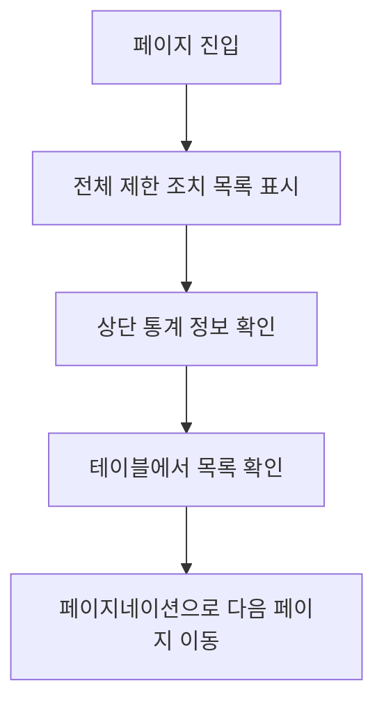
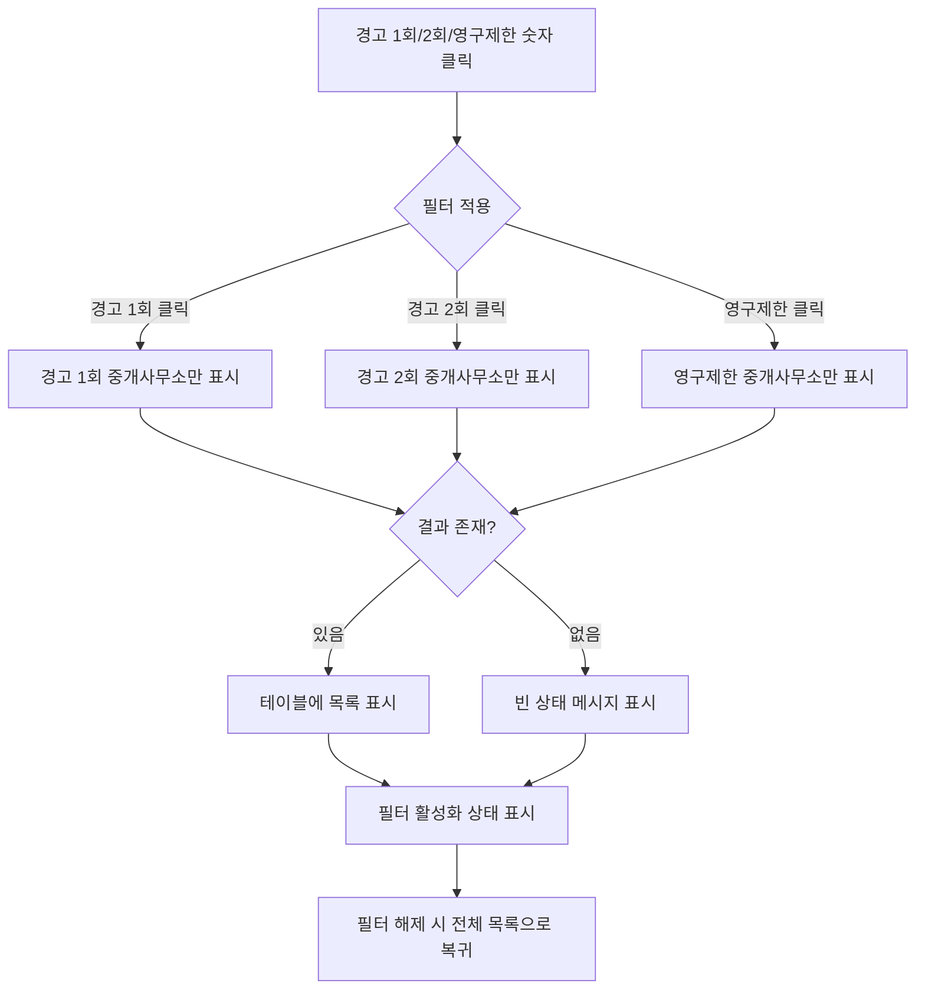

# 전체 중개사무소 제한조치 현황

## 개요

허위광고OUT 메뉴의 첫 번째 서브메뉴로, 전체 중개사무소의 제한조치 현황을 조회하고 관리할 수 있는 페이지입니다.

## 목표

- 제한 조치된 중개사무소 현황을 한눈에 파악할 수 있도록 제공
- 제한 조치 유형별(경고 1회, 경고 2회, 영구 제한) 현황을 빠르게 확인할 수 있도록 지원
- 제한 조치 내역을 시간순으로 확인하여 추이를 파악할 수 있도록 제공

## 사용자 스토리

### 주요 사용자
- CEO 사이트를 사용하는 중개사무소 대표 (회원)

### 사용자 시나리오
1. **현황 조회**: 제한 조치된 중개사무소의 전체 현황과 총 개수를 확인하고 싶다
2. **유형별 조회**: 경고 1회, 경고 2회, 영구 제한 조치를 받은 중개사무소를 각각 확인하고 싶다
3. **필터링**: 특정 제한 조치 유형을 클릭하여 해당 유형의 중개사무소만 목록으로 보고 싶다
4. **상세 확인**: 특정 중개사무소의 제한 조치 내역(날짜, 위반 정책, 처리 내용)을 확인하고 싶다

## 비즈니스 규칙

### 제한 조치 유형
제한 조치는 총 2가지 유형이 있습니다:
- **경고**: 경고 1회, 경고 2회까지 가능
- **영구 제한**: 경고 3회 이상인 경우 영구 제한 조치를 받게 됨

### 제한 조치 처리 규칙
- 중개사무소가 위반 정책을 위반하면 경고 1회가 부여됨
- 경고 1회를 받은 중개사무소가 다시 위반하면 경고 2회가 부여됨
- 경고 2회를 받은 중개사무소가 다시 위반하면 영구 제한 조치가 부여됨

## 기능 요구사항

### 1. 상단 요약 정보
- [ ] 제한 조치된 중개사무소 총 개수 표시
- [ ] 리스팅한 기간 표시 (최근 1년 기준, yyyy-mm-dd 형식으로 표기)
  - 예: "최근 1년 기준 (2025-01-16 ~ 2026-01-16)"

### 2. 제한 조치 유형별 통계 및 필터
- [ ] 테이블 상단에 경고 1회, 경고 2회, 영구 제한 조치를 받은 중개사무소 각각의 숫자 표시
- [ ] 각 숫자를 클릭하면 해당 조건의 중개사무소만 필터링되어 목록에 표시됨
- [ ] 기본 상태는 제한 조치된 중개사무소 전체 목록이 표시됨
- [ ] 필터가 적용된 상태에서는 해당 필터가 활성화된 것으로 시각적으로 표시됨
- [ ] 필터 적용 시 해당 조건에 맞는 중개사무소가 없는 경우, 빈 상태 메시지를 표시
  - 빈 상태 메시지: "해당 조건에 맞는 제한 조치 내역이 없습니다."
  - 테이블 대신 빈 상태 메시지가 표시되고, 페이지네이션은 숨김 처리

### 3. 목록 조회
- [ ] 제한 조치된 중개사무소 목록을 테이블 형태로 표시
- [ ] 한 페이지에 10개까지 노출
- [ ] 페이지네이션 적용
- [ ] 정렬 순서는 최신순 (제한 조치 날짜 기준 내림차순)
- [ ] 테이블 상단에 "총 n건" 표시

### 4. 테이블 컬럼 구성
테이블은 다음 5개의 컬럼으로 구성됩니다:

1. **날짜**
   - 제한 조치가 적용된 날짜
   - 표기 형식: yyyy-mm-dd (예: 2026-01-16)

2. **중개사무소**
   - 중개사무소 이름과 대표자명을 함께 표시
   - 표기 형식: "중개사무소이름(대표:대표자명)"
   - 예: "직방부동산(대표:홍길동)"

3. **지역**
   - 중개사무소 소재지
   - 표기 형식: "시 구" 또는 "도 시 구" (공백으로 구분)
   - 예: "서울 강남구", "경기 성남시 분당구"

4. **위반 정책**
   - 위반한 정책명 표시
   - "안심중개사규정" 또는 "안심광고관리규정" 또는 둘 다
   - 둘 다 위반한 경우: "안심중개사규정, 안심광고관리규정" 형식으로 표시

5. **처리**
   - 제한 조치 유형 표시
   - 값: "경고 1회", "경고 2회", "영구제한"
   - 영구제한인 경우 빨간색으로 색상 코딩

### 5. 반응형 처리
- [ ] 모바일 해상도 390px 이하에서는 일부 컬럼을 미노출
- [ ] 390px 이하에서 표시되는 컬럼: 날짜, 중개사무소, 처리 (3개만)
- [ ] 390px 이하에서 미노출되는 컬럼: 지역, 위반 정책

## UI/UX 요구사항

### 레이아웃
- 데스크톱: 사이드바 + 메인 컨텐츠 영역
- 모바일: 전체 화면 (사이드바는 햄버거 메뉴로 접근)

### 컴포넌트
- **Table**: 제한 조치 목록 표시 (zigbang-design-system.json의 Table 컴포넌트 사용)
- **text button**: 제한 조치 유형별 통계 숫자 표시 및 필터 버튼 역할
- **Pagination**: 페이지네이션 컴포넌트
- **Typography**: 총 개수, 기간, 총 n건 등 텍스트 표시
- **Empty State**: 필터 결과가 없을 때 표시할 빈 상태 메시지

### 디자인 토큰
- 색상: zigbang-design-system.json의 colors 토큰만 사용
  - 영구제한 색상: destructive 또는 적절한 빨간색 토큰 사용
- 타이포그래피: Pretendard, 정의된 fontSizes/fontWeights만 사용
- 간격: spacing 토큰 사용
- 라운드: radius 토큰 사용

### 날짜 표기 규칙
- 날짜 형식: yyyy-mm-dd (ISO 8601 형식, 한글 기준)
- 예: 2026-01-16
- 리스팅 기간 표시: "2025-01-16 ~ 2026-01-16" 형식

### 반응형
- 모바일 기준점: 768px
- 특수 반응형: 390px 이하에서 컬럼 일부 미노출
  - 390px 이하: 날짜, 중개사무소, 처리 컬럼만 표시
  - 390px 초과: 모든 컬럼 표시

## 데이터 요구사항

### 저장해야 할 정보
각 제한 조치 내역에는 다음 정보가 포함되어야 합니다:

- 제한 조치 날짜 (제한 조치가 적용된 날짜)
- 중개사무소 이름
- 중개사무소 대표자명
- 중개사무소 소재지 (시/도, 시, 구 정보)
- 위반 정책 (안심중개사규정, 안심광고관리규정 중 하나 또는 둘 다)
- 제한 조치 유형 (경고 1회, 경고 2회, 영구제한)

### 통계 정보
페이지 상단에 표시할 통계 정보:
- 제한 조치된 중개사무소 총 개수
- 경고 1회를 받은 중개사무소 개수
- 경고 2회를 받은 중개사무소 개수
- 영구 제한 조치를 받은 중개사무소 개수
- 리스팅 기간 (최근 1년 기준 시작일과 종료일)

### 정렬 및 페이지네이션
- 목록은 제한 조치 날짜 기준 최신순으로 정렬되어야 함
- 한 페이지에 10개씩 표시
- 전체 개수 정보 제공 필요

## 사용자 플로우

### 기본 조회 플로우

### 필터링 플로우

## 우선순위

### Phase 1 (MVP)
1. 상단 통계 정보 표시 (총 개수, 기간)
2. 제한 조치 유형별 통계 및 필터 기능
3. 목록 조회 (최신순 정렬, 페이지네이션)
4. 테이블 컬럼 표시 (날짜, 중개사무소, 지역, 위반 정책, 처리)
5. 반응형 처리 (390px 이하 컬럼 미노출)

### Phase 2 (향후 고려)
1. 검색 기능 (중개사무소명, 지역 검색)
2. 상세 정보 조회
3. 엑셀 다운로드
4. 추가 필터링 옵션

## Success Criteria

이 기능 출시 후 달성하고자 하는 목표:

- 운영 관리자가 제한 조치 현황을 5분 이내에 파악할 수 있다
- 제한 조치 유형별 현황을 클릭 한 번으로 확인할 수 있다
- 모바일 환경에서도 핵심 정보(날짜, 중개사무소, 처리)를 빠르게 확인할 수 있다

## 예외 처리 및 엣지 케이스

### 필터 결과가 없는 경우
- 필터를 적용했을 때 해당 조건에 맞는 중개사무소가 없는 경우:
  - 테이블 대신 빈 상태 메시지를 표시
  - 빈 상태 메시지 문구: "해당 조건에 맞는 제한 조치 내역이 없습니다."
  - 페이지네이션은 숨김 처리
  - 상단 통계 정보(총 개수, 기간)는 그대로 유지
  - 필터 버튼은 활성화 상태로 유지하여 사용자가 필터가 적용된 상태임을 인지할 수 있도록 함

### 초기 로딩 상태
- 데이터를 불러오는 중일 때는 로딩 상태를 표시
- 로딩 완료 후 결과가 없으면 빈 상태 메시지 표시

## 참고사항

- 날짜 표기는 ISO 8601 형식(yyyy-mm-dd)을 한글 기준으로 적용
- 영구제한 색상 코딩은 사용자에게 경각심을 주기 위한 시각적 강조
- 리스팅 기간은 최근 1년 기준이며, 필요에 따라 기간 조정 가능
- 접근 권한 관리 필요 (일부 사용자만 접근 가능할 수 있음)
- 지역 표기는 공백으로 구분하여 표시 (예: "서울 강남구")

## 변경 이력

| 날짜 | 작성자 | 변경 내용 |
|------|--------|----------|
| 2026-01-16 | - | 초안 작성 |
| 2026-01-16 | - | 상세 요구사항 반영 (제한 조치 유형, 테이블 컬럼, 필터링, 반응형 등) |
| 2026-01-16 | - | 사용자 정의 수정 반영, 지역 표기 형식 수정, 필터 빈 결과 처리 규칙 추가 |
| 2026-01-16 | - | 페이지당 항목 수 20개에서 10개로 변경 |
